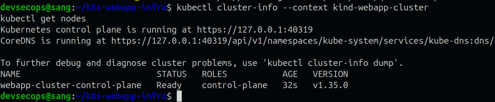
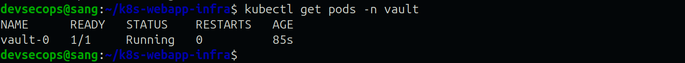

# k8s-webapp-infra

> **Repository:** https://github.com/officialsangdavid/k8s-webapp-infra

A production-grade, GitOps-friendly Kubernetes deployment for a web application (`webapp`) across two fully isolated environments — **staging** and **production** — built with Kustomize for manifest management and External Secrets Operator (ESO) with HashiCorp Vault for secure, auditable secret management.

---

## The Mental Model

Before touching a single file, I asked one question:

> *"What problem am I actually solving, and what does the end state look like?"*

The answer drove every decision in this repository:

- **Any engineer should be able to clone this repo and deploy a full environment with one command** — no tribal knowledge, no manual steps, no undocumented dependencies
- **No secret value should ever touch Git, ever** — not plaintext, not base64, not encrypted blobs tied to a single cluster
- **Staging and production environments are completely isolated** — a change to one overlay cannot accidentally affect the other, including the secrets layer
- **The structure is extensible** — adding a third environment such as `qa` means copying an overlay folder and changing four values. That is it.

This is not just a Kubernetes project. It is a demonstration of how a platform team thinks about repeatability, security, and operational maturity.

---

## Architecture
The project Architecture is described below:


The flow happens in this order:
1. From Git to a running pod with secrets injected: 
Git Repository >> ExternalSecret manifests — zero secret values, safe to make public
2. Kustomize: 
(merges base + overlay into environment-specific manifests)
3. kubectl apply -k: 
The Single command deploys entire environment
4. External Secrets Operator: 
watches ExternalSecret resources, authenticates to Vault via Kubernetes ServiceAccount
5. HashiCorp Vault: 
Enforces eso-webapp-policy — read only, specific paths per environment
6. Kubernetes Secret: 
Created automatically in the correct namespace — never committed to Git
7. webapp Pod: 
DB_PASSWORD and API_KEY available as environment variables at runtime

---

## Repository Structure


## Environment Differences

| Configuration     | Staging                  | Production                  |
|-------------------|--------------------------|-----------------------------|
| Namespace         | staging                  | production                  |
| Replicas          | 1                        | 3                           |
| Image tag         | nginx:1.25               | nginx:1.27                  |
| Vault secret path | secret/staging/webapp    | secret/production/webapp    |

---

## Prerequisites

| Tool        | Version Used | Purpose                        |
|-------------|--------------|--------------------------------|
| `kubectl`   | v1.35.3      | Kubernetes CLI                 |
| `kustomize` | v5.7.1       | Manifest management            |
| `helm`      | v3.21.0      | Installing Vault and ESO       |
| `kind`      | v0.31.0      | Local Kubernetes cluster       |
| `git`       | v2.43.0      | Version control                |
| `docker`    | v29.4.0      | Container runtime for kind     |

---

## Full Deployment Guide

Follow these steps exactly to replicate the full working environment from scratch.

---

### Phase 1 — Create the Local Cluster

```bash
cat > /tmp/kind-config.yaml << 'EOF'
kind: Cluster
apiVersion: kind.x-k8s.io/v1alpha4
name: webapp-cluster
nodes:
  - role: control-plane
EOF

kind create cluster --config /tmp/kind-config.yaml
kubectl cluster-info --context kind-webapp-cluster
kubectl get nodes
```

Wait until the node shows `STATUS=Ready` before proceeding.



---

### Phase 2 — Install HashiCorp Vault

Vault is the secure backend where all secret values live. No secret value ever leaves Vault into Git.

```bash
helm repo add hashicorp https://helm.releases.hashicorp.com
helm repo update

helm install vault hashicorp/vault \
  -f infra/vault/vault-values.yaml \
  -n vault \
  --create-namespace

kubectl wait --for=condition=ready pod \
  -l app.kubernetes.io/name=vault \
  -n vault --timeout=120s

kubectl get pods -n vault
```



---

### Phase 3 — Configure Vault

Exec into the Vault pod and configure secrets, policy, and Kubernetes auth:

```bash
kubectl exec -it vault-0 -n vault -- /bin/sh
```

Inside the pod:

```sh
# Authenticate with root token (dev mode)
vault login root

# Enable Kubernetes auth method
vault auth enable kubernetes

# Configure Kubernetes auth to verify ServiceAccount tokens
vault write auth/kubernetes/config \
  kubernetes_host="https://$KUBERNETES_PORT_443_TCP_ADDR:443" \
  kubernetes_ca_cert=@/var/run/secrets/kubernetes.io/serviceaccount/ca.crt \
  token_reviewer_jwt=@/var/run/secrets/kubernetes.io/serviceaccount/token

# Store staging secrets
vault kv put secret/staging/webapp \
  DB_PASSWORD="your-staging-db-password" \
  API_KEY="your-staging-api-key"

# Store production secrets
vault kv put secret/production/webapp \
  DB_PASSWORD="your-production-db-password" \
  API_KEY="your-production-api-key"

# Create a least-privilege policy for ESO
vault policy write eso-webapp-policy - << 'EOF'
path "secret/data/staging/webapp" {
  capabilities = ["read"]
}
path "secret/data/production/webapp" {
  capabilities = ["read"]
}
path "secret/metadata/staging/webapp" {
  capabilities = ["read"]
}
path "secret/metadata/production/webapp" {
  capabilities = ["read"]
}
EOF

# Bind ESO ServiceAccount to the policy via a Vault role
vault write auth/kubernetes/role/eso-role \
  bound_service_account_names=external-secrets \
  bound_service_account_namespaces=external-secrets \
  policies=eso-webapp-policy \
  ttl=1h

exit
```


---

### Phase 4 — Install External Secrets Operator

ESO is the bridge between Kubernetes and Vault. It watches `ExternalSecret` resources and automatically creates real Kubernetes Secrets by fetching values from Vault — nothing manual, nothing committed to Git.

```bash
helm repo add external-secrets https://charts.external-secrets.io
helm repo update

helm install external-secrets external-secrets/external-secrets \
  -f infra/eso/eso-values.yaml \
  -n external-secrets \
  --create-namespace

kubectl wait --for=condition=ready pod \
  -l app.kubernetes.io/name=external-secrets \
  -n external-secrets --timeout=120s

kubectl get pods -n external-secrets
```


---

### Phase 5 — Apply ClusterSecretStore

The `ClusterSecretStore` is the cluster-wide configuration that tells ESO how to reach Vault and authenticate using the Kubernetes ServiceAccount method:

```bash
kubectl apply -f infra/eso/cluster-secret-store.yaml

# Verify it is Valid before proceeding
kubectl get clustersecretstore vault-cluster-store
```

Expected output:
NAME                  AGE   STATUS   CAPABILITIES   READY
vault-cluster-store   10s   Valid    ReadWrite      True


Do not proceed until `READY=True`. If it shows `InvalidProviderConfig`, check the Vault Kubernetes auth configuration and ESO pod logs.

---

### Phase 6 — Deploy Staging

Single command deployment:

```bash
kubectl apply -k k8s/overlays/staging
```

Verify:

```bash
kubectl get pods -n staging
kubectl get externalsecret -n staging
kubectl get secret webapp-secret -n staging
```


Access the application locally:

```bash
kubectl port-forward \
  $(kubectl get pod -n staging -l app=webapp \
  -o jsonpath='{.items[0].metadata.name}') \
  8080:80 -n staging
```

Open `http://localhost:8080` in your browser.


---

### Phase 7 — Deploy Production

Single command deployment:

```bash
kubectl apply -k k8s/overlays/production
```

Verify:

```bash
kubectl get pods -n production
kubectl get externalsecret -n production
kubectl get secret webapp-secret -n production
```


Access the application locally:

```bash
kubectl port-forward \
  $(kubectl get pod -n production -l app=webapp \
  -o jsonpath='{.items[0].metadata.name}') \
  8081:80 -n production
```

Open `http://localhost:8081` in your browser.
```


---

### Full Verification

```bash
# All pods running
kubectl get pods -n staging
kubectl get pods -n production

# Secrets created by ESO — values never exposed
kubectl get secret webapp-secret -n staging -o yaml
kubectl get secret webapp-secret -n production -o yaml

# ExternalSecrets synced
kubectl get externalsecret -n staging
kubectl get externalsecret -n production

# ClusterSecretStore healthy
kubectl get clustersecretstore vault-cluster-store
```


---

## Kustomize Build Validation

The repository includes pre-generated build outputs to validate the Kustomize structure without requiring cluster access:

- **Staging**: [`k8s/build-output/staging-manifest.yaml`](k8s/build-output/staging-manifest.yaml)
- **Production**: [`k8s/build-output/production-manifest.yaml`](k8s/build-output/production-manifest.yaml)

Additionally, actual cluster state captures from the working deployment are included:
- [`k8s/build-output/staging-cluster-state.txt`](k8s/build-output/staging-cluster-state.txt)
- [`k8s/build-output/production-cluster-state.txt`](k8s/build-output/production-cluster-state.txt)

These files prove the Kustomize base/overlay pattern works correctly and that both environments deployed successfully.

---

## Secret Management Approach

### Why Not Sealed Secrets

> *"I considered Sealed Secrets but I then rejected it — while it solves the Git safety problem, it couples secret management to the cluster, provides no rotation capability, no audit trail, and no access policy enforcement. 
> 
> For a production platform team, secrets management is a security domain, not just a deployment concern. ESO with HashiCorp Vault decouples secret storage from Kubernetes entirely, enables automatic rotation, provides full audit logging via Vault's audit backend, and supports multi-cluster and multi-cloud topologies without re-encrypting secrets per cluster."*

### Why ESO + HashiCorp Vault

| Capability | Sealed Secrets | ESO + Vault |
|---|---|---|
| Safe in public Git | ✅ | ✅ |
| Secret rotation | ❌ Manual | ✅ Automatic |
| Audit trail | ❌ | ✅ |
| Access policies per team | ❌ | ✅ |
| Multi-cluster support | ❌ Weak | ✅ Strong |
| Cloud agnostic | ❌ | ✅ |
| Kubernetes native auth | ❌ | ✅ |
| Enterprise ready | ❌ | ✅ |

### How Secrets Flow


### Principle of Least Privilege

The `eso-webapp-policy` grants ESO read access to exactly two paths and nothing else:

```hcl
path "secret/data/staging/webapp" {
  capabilities = ["read"]
}
path "secret/data/production/webapp" {
  capabilities = ["read"]
}
```

A compromised ESO pod cannot read any other secrets in Vault.

---

## Challenges Encountered and How I Solved Them

### Challenge 1 — ESO API Version Migration

**What happened:** All manifests were initially written against `external-secrets.io/v1beta1` based on documentation. On apply, every resource returned `resource mapping not found`.

**Root cause:** The installed ESO version had migrated to `external-secrets.io/v1`. The CRDs were registered under the new version but kubectl could not map the old version string.

**How I solved it:** Rather than guessing, I ran:
```bash
kubectl api-resources --verbs=list | grep external
```
This revealed the correct API version. I updated all manifests with a targeted sed command across every affected file.

**Lesson:** Always verify installed CRD versions against your manifests. Documentation versions and installed versions are not always the same.

---

### Challenge 2 — ESO Validating Webhook Race Condition

**What happened:** Even after CRDs were confirmed registered, applying the `ClusterSecretStore` returned `resource mapping not found`. The webhook pod was running but not yet ready to serve admission requests.

**How I solved it:**
```bash
kubectl rollout restart deployment/external-secrets-webhook -n external-secrets
kubectl rollout status deployment/external-secrets-webhook -n external-secrets
```

Waiting for the rollout to complete before applying resolved the issue entirely.

**Lesson:** On fresh ESO installations, always wait for the webhook deployment to fully roll out before applying ESO custom resources. This is a known race condition worth documenting in any runbook.

---

### Challenge 3 — Vault Kubernetes Auth Audience Mismatch

**What happened:** After switching from static token auth to the more secure Kubernetes ServiceAccount auth method, ESO returned a `403 invalid audience (aud) claim` error when attempting to log in to Vault.

**Root cause:** Setting an explicit `audience="vault"` on the Vault role required the JWT token ESO presented to carry a matching audience claim. In the kind dev cluster environment the generated ServiceAccount token carried a different audience value, causing the mismatch.

**How I solved it:** I deleted and fully recreated the Vault role without an audience restriction for the dev environment:
```bash
vault delete auth/kubernetes/role/eso-role
vault write auth/kubernetes/role/eso-role \
  bound_service_account_names=external-secrets \
  bound_service_account_namespaces=external-secrets \
  policies=eso-webapp-policy \
  ttl=1h
```

**Production approach:** In production, the audience is explicitly set and matched on both sides — the Vault role carries `audience="vault"` and the ESO `ClusterSecretStore` `serviceAccountRef` carries a matching `audiences: ["vault"]` field. This ensures tokens are scoped specifically for Vault and cannot be replayed against other systems.

---

## Assumptions and Trade-offs

**Vault in dev mode**
Vault runs in dev mode (`server.dev.enabled: true`) — a deliberate choice for local environment reproducibility. Dev mode requires zero initialisation or unsealing steps, making the deployment guide fully repeatable for anyone cloning this repo. The trade-off is that dev mode stores data in memory only — a pod restart requires re-adding secrets to Vault. In production, Vault would run in HA mode with Raft integrated storage, auto-unseal via cloud KMS, and the root token revoked immediately after initial setup.

**Kubernetes auth without explicit audience**
The Vault Kubernetes auth role is configured without an explicit audience restriction due to a token audience mismatch in the kind cluster environment. In production, both the Vault role and the ESO `serviceAccountRef` would carry matching explicit audience values for hardened JWT claim verification.

**Single node cluster**
The kind cluster runs on a single control-plane node. In production, dedicated worker nodes with pod anti-affinity rules would ensure the 3 production replicas are scheduled across separate physical nodes for true high availability.

**Static root token for Vault configuration**
The dev mode root token is used for initial Vault configuration only. In production this would be a break-glass credential — generated at init, used once to configure auth methods and policies, then immediately revoked. All ongoing access would use policy-scoped tokens or ServiceAccount JWT authentication.

**Port-forward for local access**
The application is accessed locally via `kubectl port-forward`. In production an Ingress controller with TLS termination via cert-manager would expose the application externally with automatic certificate lifecycle management.

---

## Repeatability and Extensibility

**Repeatability:** Every step in this guide is scripted and documented. Anyone cloning this repository can follow the deployment guide from Phase 1 to Phase 7 and arrive at an identical running environment. No manual steps exist outside the documented commands.

**Extensibility:** Adding a third environment such as `qa` requires:
1. Copy `k8s/overlays/staging/` to `k8s/overlays/qa/`
2. Update the namespace, replica count, image tag, and Vault path in four files
3. Add the `qa/webapp` secret path to `eso-webapp-policy` in Vault
4. Run `kubectl apply -k k8s/overlays/qa`

That is the entire process. The base manifests are never touched.

---

## What I Would Improve Given More Time

- **Vault Kubernetes auth with explicit audience** — properly align audience claims on both the Vault role and ESO `serviceAccountRef` in a production-grade cluster for hardened JWT verification
- **Vault HA mode** — Raft integrated storage, multi-node deployment, auto-unseal via cloud KMS
- **Pod Disruption Budgets** — guarantee rolling updates never take all production replicas offline simultaneously
- **Pod Anti-affinity rules** — force production replicas onto separate nodes preventing single node failure causing full downtime
- **Network Policies** — restrict inter-namespace traffic so staging pods cannot reach production services or the Vault namespace
- **CI/CD pipeline** — GitHub Actions workflow running `kustomize build` on every pull request to validate manifests before merge, and `kubectl diff` to show planned cluster changes
- **Resource Quotas per namespace** — prevent runaway staging deployments consuming production-bound resources
- **Ingress with TLS** — cert-manager handling full certificate lifecycle via Let's Encrypt
- **Vault audit logging** — persistent audit log sink for compliance and incident investigation
- **Secret rotation end-to-end test** — documented and tested procedure confirming ESO picks up rotated Vault secrets within the refresh interval without pod restarts

---

## Kustomize Build Output

Pre-built output is committed for validation without a running cluster:

- [`k8s/build-output/staging-output.yaml`](k8s/build-output/staging-output.yaml)
- [`k8s/build-output/production-output.yaml`](k8s/build-output/production-output.yaml)
- [`k8s/build-output/staging-cluster-state.txt`](k8s/build-output/staging-cluster-state.txt)
- [`k8s/build-output/production-cluster-state.txt`](k8s/build-output/production-cluster-state.txt)

To regenerate:
```bash
kustomize build k8s/overlays/staging
kustomize build k8s/overlays/production
```

---

## Cleanup / Destroy the Environment

To fully remove the local development environment and all deployed resources:

### Delete application workloads

```bash
kubectl delete -k k8s/overlays/staging
kubectl delete -k k8s/overlays/production
```


### Delete namespaces

```bash
kubectl delete namespace staging
kubectl delete namespace production
kubectl delete namespace external-secrets
kubectl delete namespace vault
```


### Destroy the kind cluster

```bash
kind delete cluster --name webapp-cluster
```


### Verify cleanup

```bash
kind get clusters
kubectl config get-contexts
```

After deletion, the local Kubernetes environment is fully cleaned up and no cluster resources remain running.